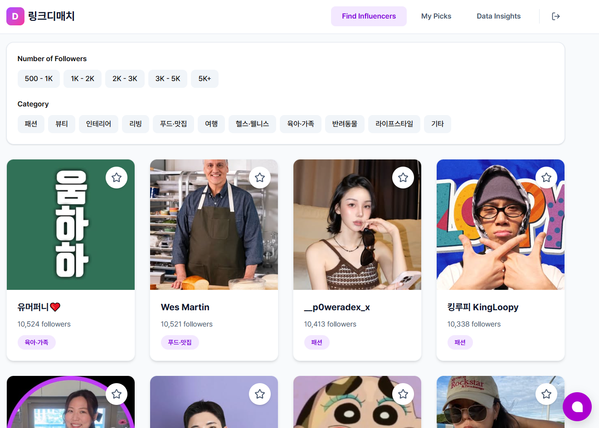
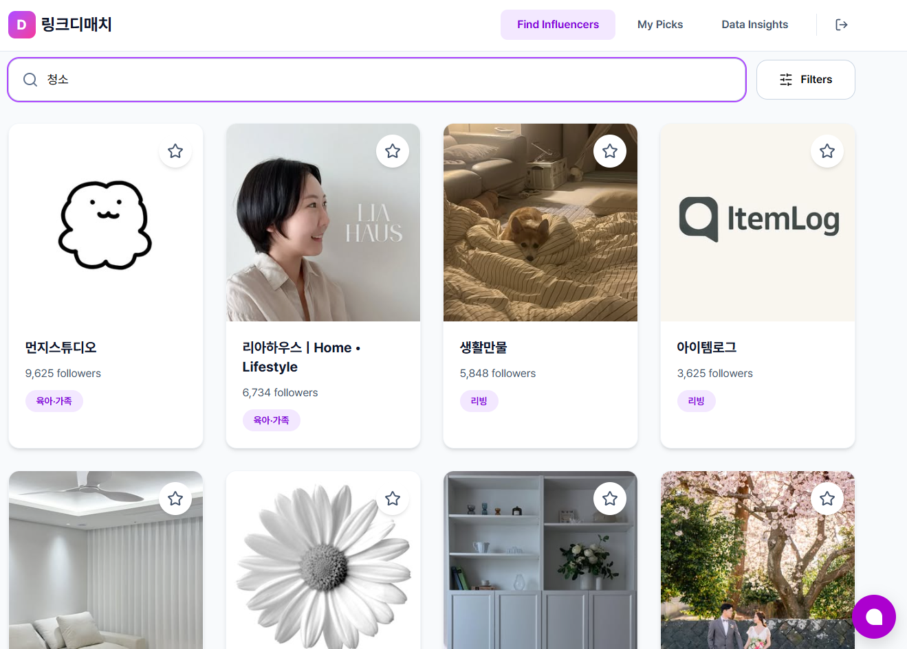
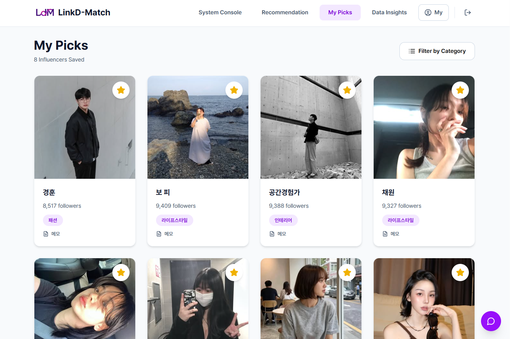
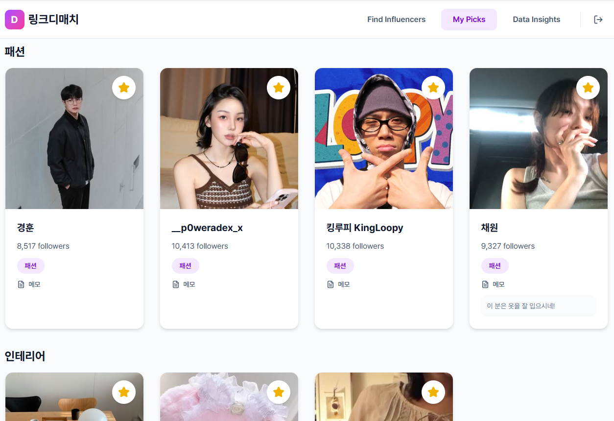
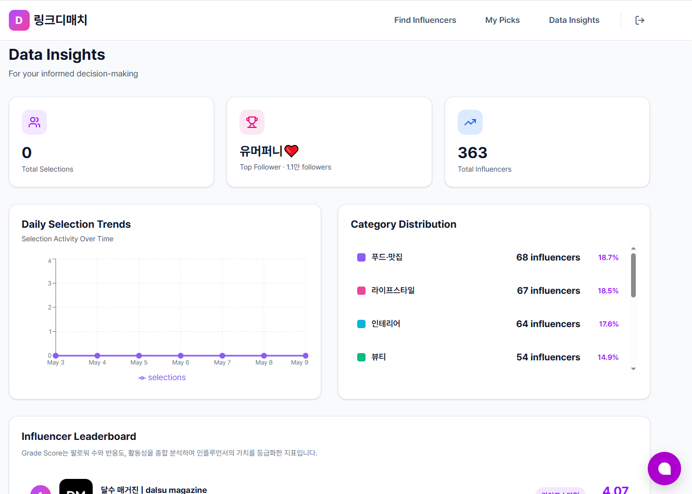
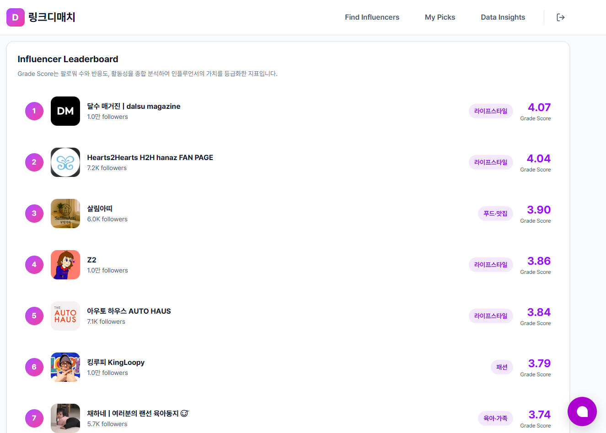
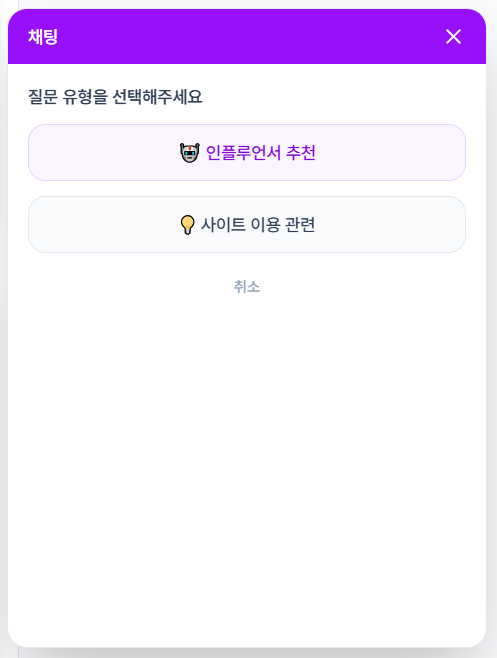
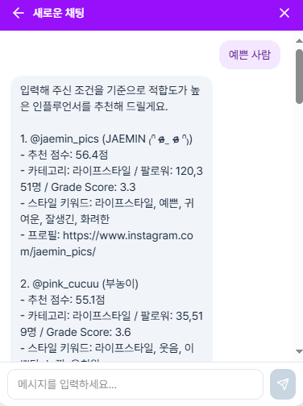

## 💡 프로젝트 배경

### ⏳ 어필리에이트 마케팅의 인플루언서 탐색에 많은 시간 소요
- 🔍 상품과 어울리는 인플루언서를 직접 검색해야 함
- 📊 콘텐츠 분위기, 카테고리, 팔로워 수 등을 하나씩 비교해야 함
- 🤔 브랜드 이미지와 맞는 계정을 판단하기 어려움
- 💸 소규모 쇼핑몰은 인력·예산 부족으로 탐색 부담 증가

 

## 🚀 프로젝트 소개

### AI 기반 인플루언서 매칭 솔루션

> **“수작업 탐색에서 AI 기반 추천 매칭으로”**  
> **“상품과 어울리는 인플루언서를 AI로 더 빠르고 정확하게”**

Link:D Match는 쇼핑몰 상품 정보와 인플루언서 데이터를 분석하여, 상품과 가장 어울리는 인플루언서를 추천하는 AI 기반 인플루언서 매칭 솔루션

### ⏱️ 탐색 시간 및 비용 절감

- 인플루언서 탐색 과정 자동화를 통해 수작업 비교 부담을 줄이고, 탐색에 소요되는 시간과 비용을 절감할 수 있음

### 🛍️ 소규모 쇼핑몰의 마케팅 실행 지원

- 전문 마케팅 인력이 없는 소규모 쇼핑몰도 추천 결과를 활용하여 보다 쉽게 인플루언서 마케팅을 시작할 수 있음

### 🎯 상품 적합도 기반 인플루언서 추천

- 단순 수치 지표(팔로워 수, 좋아요 수) 중심이 아닌, 상품 적합도를 기반으로 브랜드와 어울리는 인플루언서를 추천함

 

## 📌 주요 기능

### 🔍 인플루언서 검색 기능

  
  &nbsp;
  

**조건 및 키워드 기반 인플루언서 탐색 기능**

- 카테고리, 팔로워 수 기반 검색 지원
- “청소용품”, “주방용품”과 같은 키워드를 입력하면, 해당 키워드가 미리 저장된 인플루언서를 검색 결과에 제공

 

### 🤖 인플루언서 추천 기능
<여기에 사진 넣기!>

**자연어 기반 AI 추천 기능**

#### ① 상품 정보 입력

- 사용자는 원하는 분위기의 상품 정보를 입력할 수 있음  
  예: “따뜻한 분위기의 인테리어 용품”

#### ② 추천 요소 분석 수행

- 시스템은 상품 유사도, 인플루언서 등급, 사용자 행동 로그를 종합 반영하여 추천을 수행함

#### ③ 추천 결과 제공

- 시스템은 분석 결과를 기반으로 상위 5명의 인플루언서를 카드 형식으로 제공함

 

### ⭐ 관심목록 기능

  
  &nbsp;
  
  &nbsp;

**관심 인플루언서 저장 및 메모 기능**

- 관심목록 저장 및 메모 기능을 통한 협업 후보 관리 지원

 

### 📊 통계 차트 기능

  
  &nbsp;
  
  &nbsp;

**인플루언서 통계 및 비교 기능**

- 날짜별 추천 및 선택 추이 제공
- 카테고리별 인플루언서 분포 시각화 지원
- 팔로워 수, 반응도, 활동성을 기반으로 산정한 Grade Score 리더보드 제공
- 인플루언서 비교 기능 지원

 

### 💬 챗봇 기능

  
  &nbsp;
  

**추천 안내 및 FAQ 지원 기능**

- 사용자가 입력한 상품 조건에 맞는 추천 결과 안내
- 인플루언서 선택 방법 및 추천 기준 설명
- 서비스 이용 중 자주 발생하는 질문에 대한 FAQ 제공

 

## ✨ 기대 효과

### 🛍️ 자사몰 마케팅 고도화
AI 기반 인플루언서 추천 기술로 국내 자사몰과 중소형 이커머스의 마케팅 접근성과 운영 효율 향상에 기여

### 🤖 AI 기술 경쟁력 강화
데이터 기반 추천/분석 시스템을 서비스에 적용하여 국내 AI 기반 마케팅 기술 경쟁력 강화 및 서비스 고도화에 활용

### 🌏 글로벌 시장 확장
국내 인플루언서를 해외 서비스와 연계하여 글로벌 브랜드 협업과 해외 시장 진출 가능성을 확대하고, 국내 콘텐츠 기반 수익 창출에 기여

 

## 🙋‍♂️ 팀원 소개

| 사진 | 이름 | 역할 | GitHub | Email |
|---|---|---|---|---|
|  | 고주희 (팀장) | AI & Data Processing | <a href="https://github.com/jooheeko"> @jooheeko</a> | 20222092@kookmin.ac.kr  |
|  | 이은진 | Back-end | <a href="https://github.com/molba2see"> @molba2see</a> | 20232861@kookmin.ac.kr |
|  | 최윤지  | Back-end | <a href="https://github.com/yunji0417"> @yunji0417</a> | yunji0417@kookmin.ac.kr |
|  | 백송훈 | Front-end | <a href="https://github.com/100songhoon"> @100songhoon</a> | songhoon@kookmin.ac.kr |
|  | 오형석 | Front-end | <a href="https://github.com/lovesuperlit"> @lovesuperlit</a> | ohsoksk1569@kookmin.ac.kr |

 

## 🛠️ 기술 스택

### 🔍 AI & Data Processing
| Category | Stack |
|----------|-------|
| Crawling |  |
| Classification |  |
| Recommendation |    |

### 💾 Back-end
| Category | Stack |
|----------|-------|
| Framework |  |
| Database |  |
| Container |  |

### 🖥️ Front-end
| Category | Stack |
|----------|-------|
| Framework |  |

### ☁️ DevOps
| Category | Stack |
|----------|-------|
| Cloud |  |

### 📚 Tools
| Category | Stack |
|----------|-------|
| Code Management |  |
| Collaboration |    |
| UI/UX Design |  |
| Chatbot |  |

 

### ⚙️ 사용법

소스코드제출시 설치법이나 사용법을 작성하세요.

 

## 📝 자료

발표 자료 또는 수행계획서

