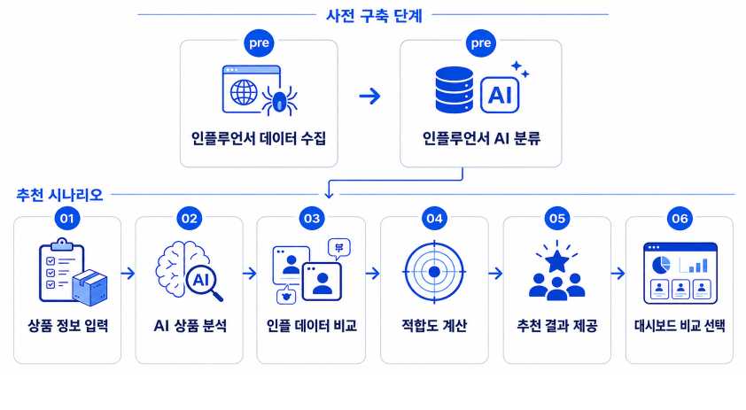

## 💡 프로젝트 배경

### ⏳ 어필리에이트 마케팅의 인플루언서 탐색에 많은 시간 소요
- 🔍 상품과 어울리는 인플루언서를 직접 검색해야 함
- 📊 콘텐츠 분위기, 카테고리, 팔로워 수 등을 하나씩 비교해야 함
- 🤔 브랜드 이미지와 맞는 계정을 판단하기 어려움
- 💸 소규모 쇼핑몰은 인력·예산 부족으로 탐색 부담 증가

 

## 🚀 프로젝트 소개

### AI 기반 인플루언서 매칭 솔루션

> “수작업 탐색 → AI 추천 자동화”

Link:D Match는 쇼핑몰 상품 정보와 인플루언서 데이터를 분석하여, 상품과 가장 어울리는 인플루언서를 추천하는 AI 기반 인플루언서 매칭 솔루션

### ⏱️ 탐색 시간 및 비용 절감

- 인플루언서 탐색 과정 자동화를 통해 수작업 비교 부담을 줄이고, 탐색에 소요되는 시간과 비용을 절감할 수 있음

### 🛍️ 소규모 쇼핑몰의 마케팅 실행 지원

- 전문 마케팅 인력이 없는 소규모 쇼핑몰도 추천 결과를 활용하여 보다 쉽게 인플루언서 마케팅을 시작할 수 있음

### 🎯 상품 적합도 기반 인플루언서 추천

- 단순 수치 지표(팔로워 수, 좋아요 수) 중심이 아닌, 상품 적합도를 기반으로 브랜드와 어울리는 인플루언서를 추천함

 

## 📌 주요 기능

주요 기능

 

## 🙋‍♂️ 팀원 소개

| 사진 | 이름 | 역할 | GitHub | 이메일 |
|---|---|---|---|---|
|  | 고주희 (팀장) | AI & Data Processing | <a href="https://github.com/jooheeko"> @jooheeko</a> |  |
|  | 이은진 | Back-end | <a href="https://github.com/molba2see"> @molba2see</a> |  |
|  | 최윤지  | Back-end | <a href="https://github.com/yunji0417"> @yunji0417</a> |  |
|  | 백송훈 | Front-end | <a href="https://github.com/100songhoon"> @100songhoon</a> |  |
|  | 오형석 | Front-end | <a href="https://github.com/lovesuperlit"> @lovesuperlit</a> | ohsoksk1569@kookmin.ac.kr |

 

## 🛠️ 기술 스택

### 🔍 AI & Data Processing
| Category | Stack |
|----------|-------|
| Crawling |  |
| Classification |  |
| Recommendation |    |

### 💾 Back-end
| Category | Stack |
|----------|-------|
| Framework |  |
| Database |  |

### 🖥️ Front-end
| Category | Stack |
|----------|-------|
| Framework |  |

### ☁️ DevOps
| Category | Stack |
|----------|-------|
| Cloud |  |

### 📚 Tools
| Category | Stack |
|----------|-------|
| Code Management |  |
| Collaboration |  |
| UI/UX Design |  |
| Chatbot |  |

 

### 4. 사용법

소스코드제출시 설치법이나 사용법을 작성하세요.

 

## 📝 자료

발표 자료 또는 수행계획서

