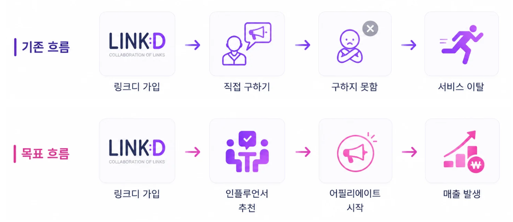
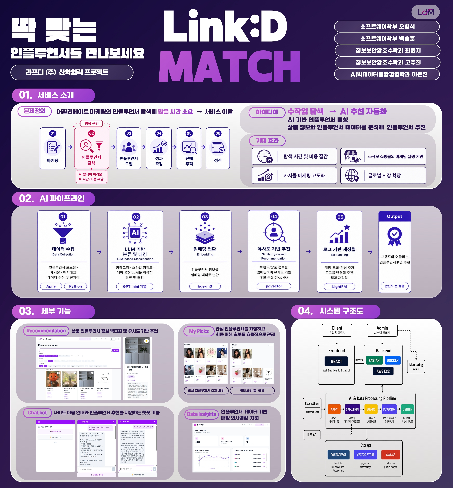
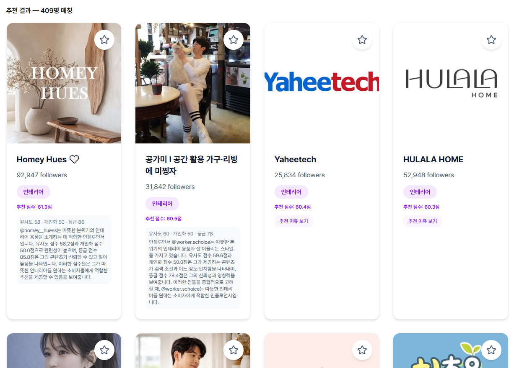
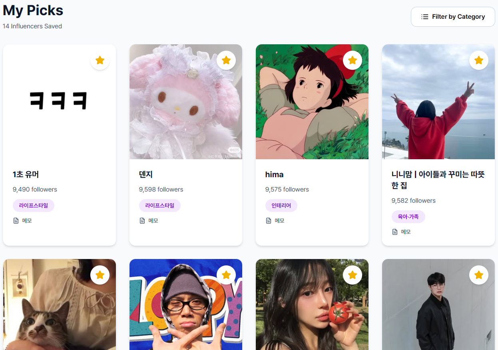
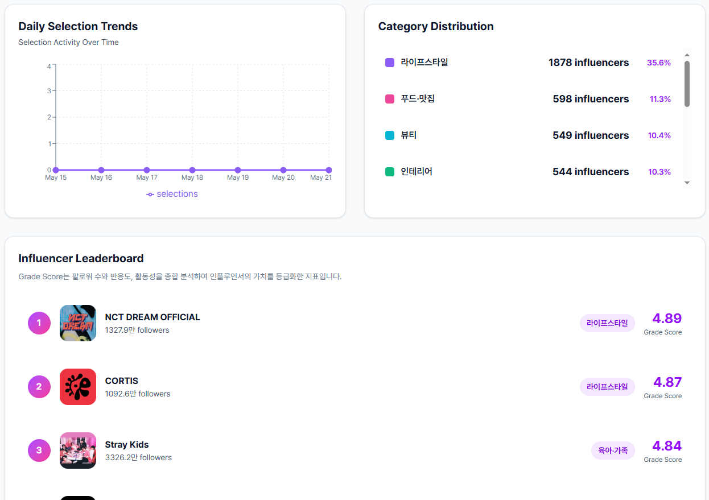
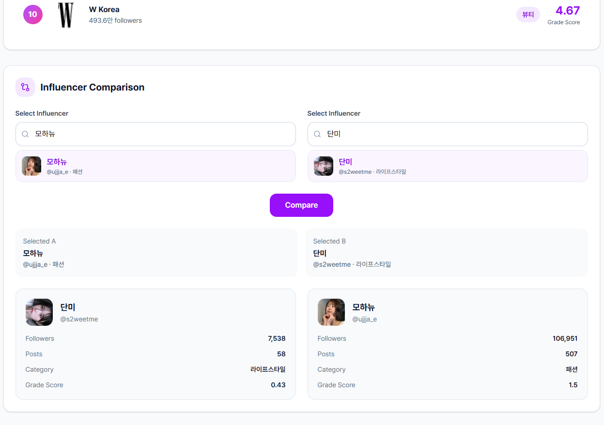
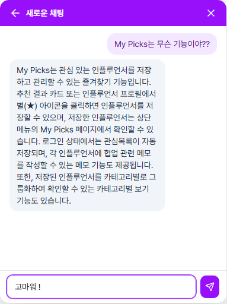
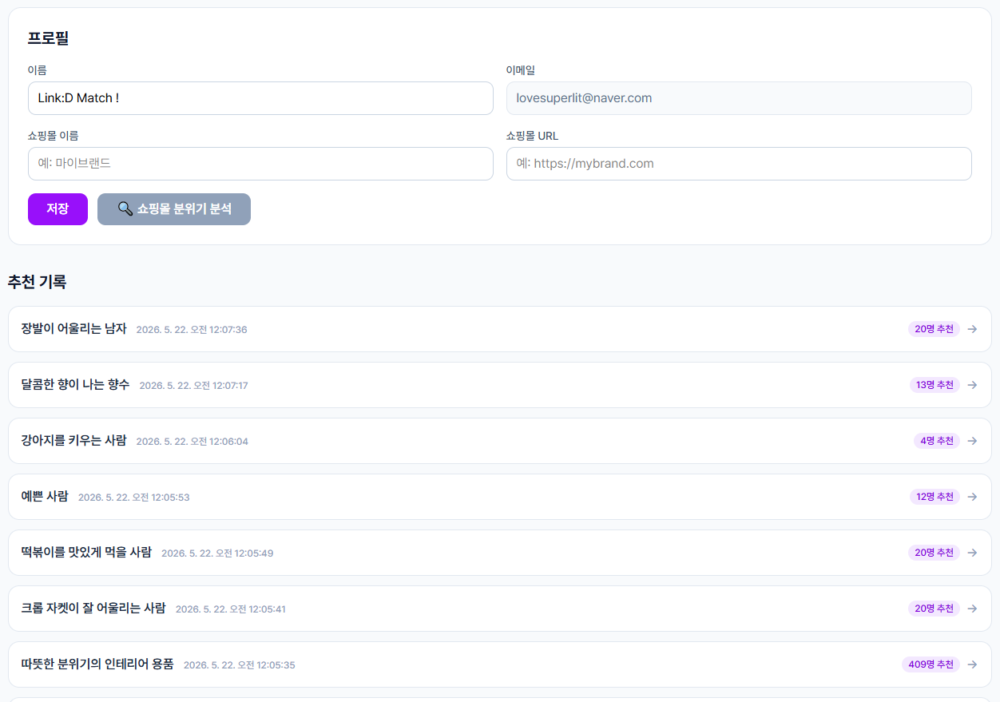

# Link:D Match

  

<h3 align="center">산학협력프로젝트</h3>

  <a href="https://linkd-match.kr/">Link:D Match로 이동</a>
  <a href="https://github.com/kookmin-sw/2026-capstone-21">GitHub로 이동</a>

 

## 💡 프로젝트 배경

  

> 어필리에이트 마케팅의 인플루언서 **탐색**에 많은 시간이 소요

- 🔍 상품과 어울리는 인플루언서를 직접 검색해야 함
- 📊 콘텐츠 분위기, 카테고리, 팔로워 수 등을 하나씩 비교해야 함
- 🤔 브랜드 이미지와 맞는 계정을 판단하기 어려움
- 💸 소규모 쇼핑몰은 인력·예산 부족으로 탐색 부담 증가

 

## 🚀 프로젝트 소개

  

### AI 기반 인플루언서 매칭 솔루션

> “수작업 탐색에서 **AI 기반 추천 매칭**으로”  
> “상품과 어울리는 인플루언서를 **AI로 더 빠르고 정확하게**”

Link:D Match는 쇼핑몰 상품 정보와 인플루언서 데이터를 분석하여, 상품과 가장 어울리는 인플루언서를 추천하는 AI 기반 인플루언서 매칭 솔루션입니다

 

### 핵심 지표

- **5,488** 인플루언서 DB 프로필
- **65,612** 게시물 데이터
- **88%+** 카테고리 분류 정확도
- **1.8s** 평균 추천 응답 지연
- **5** 사용 가능한 화면

 

### 01 인플루언서 데이터 수집

- Apify 기반 자동 수집 파이프라인
- 약 6만 5천 개 게시글 수집 완료
- 카테고리, 스타일 기반 필터
- 5,488 규모 인플루언서 DB 구축

### 02 AI 기반 인플루언서 분류

- LLM API 기반 AI 분류 엔진 구현
- 바이오 + 콘텐츠 분석 기능 구현
- 자동 카테고리 분류 시스템 구축
- 평균 분류 정확도 88% 이상 달성

### 03 매칭 추천 API

- FastAPI 기반 추천 API 개발
- 유사도 계산 및 Top N 추천, 정렬, 필터 기능 구현
- 평균 1.79 추천 결과 반환

### 04 대시보드

- React 기반 대시보드 개발
- 추천 결과 화면 구현
- 검색 및 필터 기능 구현
- 통계 차트 시각화 기능 구현

 

## 📌 주요 기능

### 🤖 인플루언서 추천 기능

  

**자연어 기반 AI 추천 기능**

#### ① 상품 정보 입력

- 사용자는 원하는 분위기의 상품 정보를 입력 가능  
  예: “따뜻한 분위기의 인테리어 용품”

#### ② 추천 요소 분석 수행

- 시스템은 상품 유사도, 인플루언서 등급, 사용자 행동 로그를 종합 반영하여 추천을 수행

#### ③ 추천 결과 제공

- 시스템은 분석 결과를 기반으로 적합도가 높은 순서대로 인플루언서 추천 결과를 카드 형식으로 제공

 

### ⭐ 관심목록 기능

  

**관심 인플루언서 저장 및 메모 기능**

- 관심목록 저장 및 메모 기능을 통한 협업 후보 관리 지원

 

### 📊 통계 차트 기능

  
  &nbsp;
  

**인플루언서 통계 및 비교 기능**

- 날짜별 추천 및 선택 추이 제공
- 카테고리별 인플루언서 분포 시각화 지원
- 팔로워 수, 반응도, 활동성을 기반으로 산정한 Grade Score 리더보드 제공
- 인플루언서 비교 기능 지원

 

### 💬 챗봇 기능

  

**추천 안내 및 FAQ 지원 기능**

- 사용자가 입력한 상품 조건에 맞는 추천 결과 안내
- 인플루언서 선택 방법 및 추천 기준 설명
- 서비스 이용 중 자주 발생하는 질문에 대한 FAQ 제공

 

### 👤 내 정보 보기 기능

  

**프로필 관리 및 추천 기록 조회 기능**

- My 페이지에서 쇼핑몰 정보를 포함한 사용자 프로필 편집 지원
- 사용자가 입력했던 추천 요청 기록을 리스트 형태로 조회 가능

 

## ✨ 기대 효과

### ⏱️ 탐색 시간 및 비용 절감

인플루언서 탐색 과정 자동화를 통해 수작업 비교 부담을 줄이고, 탐색에 소요되는 시간과 비용을 절감

### 📈 플랫폼 가치 향상

기존 LINK:D 서비스에 매칭 기능을 추가하여 쇼핑몰의 서비스 이탈을 방지하고, 어필리에이트 마케팅 시작까지의 전환율을 향상

### 🌏 글로벌 확장 가능성

국내 인플루언서를 해외 서비스와 연계하여 글로벌 브랜드 협업과 해외 시장 진출 가능성을 확대

 

## 🙋‍♂️ 팀원 소개

| 사진 | 이름 | 역할 | GitHub | Email |
|---|---|---|---|---|
|  | 고주희 (팀장) | AI & Data Processing | [@jooheeko](https://github.com/jooheeko) | 20222092@kookmin.ac.kr |
|  | 이은진 | Back-end | [@molba2see](https://github.com/molba2see) | 20232861@kookmin.ac.kr |
|  | 최윤지 | Back-end | [@yunji0417](https://github.com/yunji0417) | yunji0417@kookmin.ac.kr |
|  | 백송훈 | Front-end | [@100songhoon](https://github.com/100songhoon) | songhoon@kookmin.ac.kr |
|  | 오형석 | Front-end | [@lovesuperlit](https://github.com/lovesuperlit) | ohsoksk1569@kookmin.ac.kr |

 

## 🛠️ 기술 스택

### 🔍 AI & Data Processing

      

### 💾 Back-end

   

### 🖥️ Front-end

    

### 🗄️ DB / Storage

   

### ☁️ Infra / DevOps

  

### 📚 Tools

    

 

## 📝 자료

- [[Pickple] 수행계획서 중간평가.pdf](<./docs/files/[Pickple] 수행계획서 중간평가.pdf>)
- [[Pickple] 수행계획서 최종평가.pdf](<./docs/files/[Pickple] 수행계획서 최종평가.pdf>)
- [[Pickple] 캡스톤 기말발표 자료.pdf](<./docs/files/[Pickple] 캡스톤 기말발표 자료.pdf>)

 

<strong>Link:D Match</strong>

